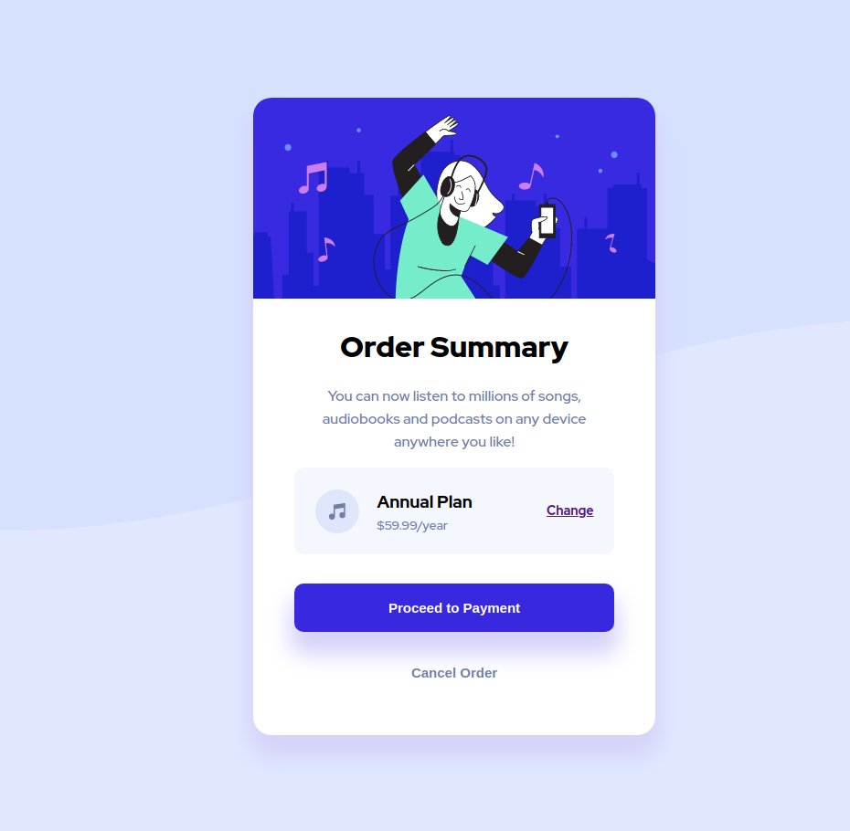

# Frontend Mentor - Order summary card solution

This is a solution to the [Order summary card challenge on Frontend Mentor](https://www.frontendmentor.io/challenges/order-summary-component-QlPmajDUj). 
Frontend Mentor challenges help you improve your coding skills by building realistic projects. 

## Table of contents

- [Overview](#overview)
  - [The challenge](#the-challenge)
  - [Screenshot](#screenshot)
  - [Links](#links)
- [My process](#my-process)
  - [Built with](#built-with)
  - [What I learned](#what-i-learned)
  - [Continued development](#continued-development)
  - [Useful resources](#useful-resources)
- [Author](#author)
- [Acknowledgments](#acknowledgments)

## Overview

### The challenge

Users should be able to:

- See hover states for interactive elements

### Screenshot




### Links

- Solution URL: https://github.com/SKLymer/Frontend-Mentor
- Live Site URL: https://github.com/SKLymer/Frontend-Mentor

## My process

### Built with
-VSCODE
- Semantic HTML5 markup
- CSS
- Flexbox
- Block


### What I learned


All of my html was pretty straightforward nothing fancy, however in the past I struggled with laying out my html in a way that was readable and easy to navigate 
but I feel like I did a pretty good job with my layout in this one.

```html

```

Initially I wasn't sure how to split the background the way it is in the design so I ended up fixing the image to the top 
then setting the width to 100% and the height to auto to maintain the ratio, and pushed it to the behind all the other elements
with z-index then I used the background-color on a 100vh
container to copy the design. I don't think it's conventional but i was pleased wih the result.

```css
.img-bck {
     position: fixed;
     top:0;
     width: 100%;
     height: auto;
     z-index: -1;
 }

```


### Continued development

I definitely need to practice manipulating images and making them more dynamic. I feel like I rely heavily on static units to get them sized properly. 
The hero segment was a challenge for me I used pixles to define the height in both the desktop and mobile views. It feels liek a cop out but I'll be back.
Also the vertical spacing between the elements I had to add individual margin-bottom properties, it felt cumbersome to me and inefficient, I'll definitely look into
refinig that as well.

Also I was a bit stumped about whether I should use buttons or links for the interacrtive elements. Like the change, Proceed to Payment and cancel buttons. 
The suitability of either element would depend on the javascript used to add functionality, for instance the change button could activate a pop-up where the user
selects or toggles on a new plan, or it could direct him back to a select plan page either option is functional and would determine which element is more aproppriate for use. 

I'd have to do some research on that as well.


### Useful resources
I ended up using two buttons instead of links so I had to google changing the cursor to add the hover effects.

https://stackoverflow.com/questions/8762201/how-to-get-the-cursor-to-change-to-the-hand-when-hovering-a-button-tag


## Author

- Website - sknconnect.com
- Frontend Mentor - https://www.frontendmentor.io/profile/SKLymer
- Twitter - https://www.twitter.com/@sklymer


## Acknowledgments

The man in the mirror.
