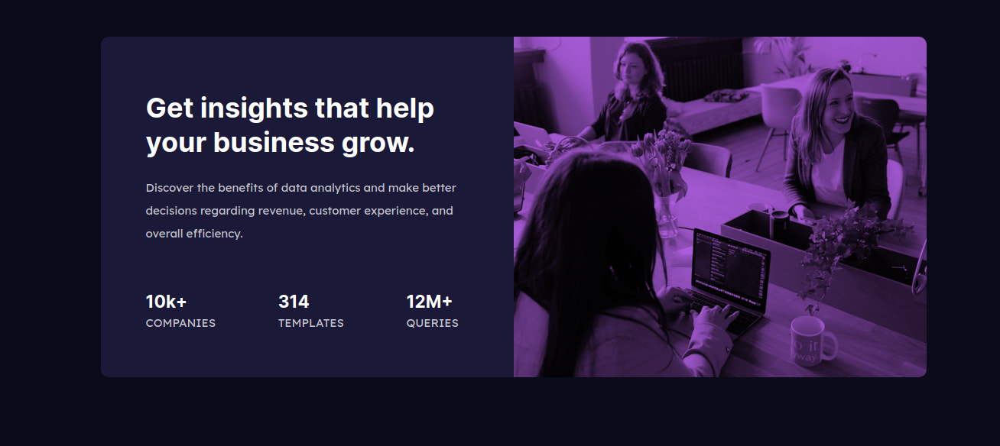

# Frontend Mentor - Stats preview card component solution

This is a solution to the [Stats preview card component challenge on Frontend Mentor](https://www.frontendmentor.io/challenges/stats-preview-card-component-8JqbgoU62). Frontend Mentor challenges help you improve your coding skills by building realistic projects. 

## Table of contents

- [Overview](#overview)
  - [The challenge](#the-challenge)
  - [Screenshot](#screenshot)
  - [Links](#links)
- [My process](#my-process)
  - [Built with](#built-with)
  - [What I learned](#what-i-learned)
  - [Continued development](#continued-development)
  - [Useful resources](#useful-resources)


## Overview

### The challenge

Users should be able to:

- View the optimal layout depending on their device's screen size

### Screenshot



- Solution URL: https://github.com/SKLymer/Frontend-Mentor
- Live Site URL: [Add live site URL here](https://your-live-site-url.com)

## My process

Started building fromt the mobile-view first, which was new for me it kind of threw me off. I found that is was
a bit disoriented when I finally got to the desktop design, but I'll stick with it to see if I can find the merrit in the method.


### Built with

- Semantic HTML5 markup
- CSS custom properties
- Flexbox
- CSS Grid
- Mobile-first workflow

### What I learned

When your image is a landscape and container is portrait set image height to max-height: 100%;
I was introduced to the mix-blend-mode: css property that finally got me the shade of purple to match the design.

-I tried srcset for image but it was taking me for a ride. So I'll have to spend more time practicing with it. Went back to the dual image system and switching them out using media queries.

-Using margin-top (while padding is set), to shift elements down doesn't affect overall size of container, but margin-bottom seemingly does, I'll also have
to test this some more. 

-Setting overall layout and design at smallest and largest viewports, then making slight adjustments for any overlapping or design flaws at
other viewpoints works for me.


Custom Properties are always a joy to use
```css

:root {

--main-bck: hsl(233, 47%, 7%);
--dark-blu: hsl(244, 38%, 16%);
--sft-vio: hsl(277, 64%, 61%);     
--main-wht: hsl(0, 0%, 100%);
--sec-wht: hsla(0, 0%, 100%, 0.75);
--stat-wht: hsla(0, 0%, 100%, 0.6);

}
```

### Continued development

-Mastering the srcset attribute
-Mastering flexbox knowing when to toggle bewtween flex and grid
-Responsive and dynamic images


### Useful resources

Got the mix-blend-mode tip from this guy.
The way he imports stylesheets is really interesting, I'll definitely be learning that soon.

https://www.youtube.com/watch?v=zaHdmJf_ld4&ab_channel=MRZ.Code.Manufacture
